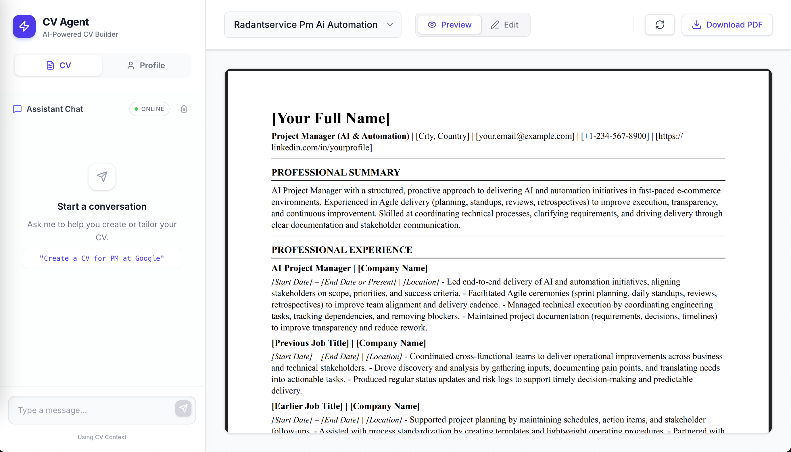

# AI CV Assistant

Transform your job search with AI-powered CV customization. Create professional, tailored resumes that highlight your most relevant experience for each job application - automatically.


<!-- TODO: Add screenshot here -->
<!--  -->

## What is AI CV Assistant?

AI CV Assistant is your intelligent career companion that helps you create customized CVs for different job applications. Instead of using the same generic resume for every job, our AI analyzes job descriptions and automatically tailors your CV to highlight the most relevant skills and experience for each position.

**Simply paste a job posting URL or describe a role, and get a perfectly tailored CV in minutes.**

## ✨ Key Features

- **🎯 Smart Job Matching**: Analyzes job requirements and emphasizes your most relevant experience
- **🔗 One-Click Job Import**: Paste any job URL and automatically extract requirements
- **📝 Profile Management**: Update your professional information through natural conversation
- **📄 Professional PDFs**: Generate polished, printable CVs with professional formatting
- **💬 Chat Interface**: Communicate naturally with the AI - no complex commands needed
- **🔒 Privacy First**: Your data stays on your computer, never sent to external servers

## 🚀 Quick Start

### Prerequisites
- A computer with internet access
- OpenAI API key (for AI processing)
- Tavily API key (for job URL analysis - optional)

### 1. Get the Application

```bash
git clone https://github.com/foets/AI-CV-Assistant.git
cd AI-CV-Assistant
```

### 2. Install Dependencies

**For the AI Engine:**
```bash
pip install -r requirements.txt
```

**For the Web Interface:**
```bash
cd web
npm install
cd ..
```

**Optional - For PDF Generation:**
```bash
pip install weasyprint
# Or on macOS: brew install weasyprint
```

### 3. Set Up Your API Keys

Copy the example configuration:
```bash
cp env_example.txt studio/.env
```

Edit `studio/.env` with your keys:
```env
OPENAI_API_KEY=sk-your-openai-key-here
TAVILY_API_KEY=your-tavily-key-here  # Optional, for job URL analysis
```

### 4. Add Your Professional Information

Copy the template and fill in your details:
```bash
cp data/user_example.md data/user.md
# Edit data/user.md with your actual experience, skills, education, etc.
```

### 5. Start the Application

**Terminal 1 - Start the AI Engine:**
```bash
cd studio
langgraph dev
```

**Terminal 2 - Start the Web Interface:**
```bash
cd web
npm run dev
```

Open [http://localhost:3000](http://localhost:3000) in your browser and start creating CVs!

## 🎯 How to Use

### Creating Your First CV

1. **Go to the CV tab** in the application
2. **Find a job posting** you're interested in applying for
3. **Paste the job URL** in the chat, or simply describe the role:

```
"Create a CV for Senior Product Manager at Google"
```

4. **Watch the AI work**: The assistant will analyze the job requirements and tailor your CV accordingly
5. **Review and download** your customized CV as a PDF

### Example Conversations

**For a specific job posting:**
```
"Create a CV for this Product Manager role: https://careers.google.com/jobs/123456"
```

**For a role description:**
```
"I need a CV for a Senior Software Engineer position focusing on React and Node.js experience"
```

**To refine an existing CV:**
```
"Make this CV more focused on my leadership experience"
"Add more technical details to the projects section"
"Make the summary more concise and impactful"
```

### Managing Your Profile

**Go to the Profile tab** to update your professional information through chat:

```
"Add Python and machine learning to my skills"
"Update my job title to Senior Engineer"
"Add my AWS certification from 2023"
```

Or click **"Edit Profile"** to manually edit your information.

## 📱 Interface Overview

The application has a clean, intuitive interface with two main sections:

- **Left Sidebar**: Chat with the AI assistant to create and modify CVs
- **Main Area**: View your CVs, edit them, or manage your profile

### Navigation
- **CV Tab**: Create and manage your tailored CVs
- **Profile Tab**: Update your professional information

## 💡 Best Practices

### Writing Better Prompts
- **Be specific** about the role: "Senior Frontend Developer at a fintech startup" vs "developer job"
- **Include location** if relevant: "Remote Senior Product Manager in Europe"
- **Mention key technologies** when you have them: "React and TypeScript experience"

### Profile Management
- **Keep it updated**: Regularly add new skills, projects, and achievements
- **Be detailed**: Include specific metrics and results in your experience descriptions
- **Use consistent formatting**: The AI works better with well-structured information

### CV Customization
- **Review before sending**: Always check the generated CV for accuracy
- **Save versions**: Create different versions for different types of roles
- **Iterate**: Use the chat to refine CVs - "Make this more concise" or "Emphasize my startup experience"

## 🔧 Troubleshooting

### "Cannot connect to agent"
Make sure both servers are running:
```bash
# Terminal 1
cd studio && langgraph dev

# Terminal 2
cd web && npm run dev
```

### "PDF generation failed"
Install weasyprint:
```bash
pip install weasyprint
```

### "API key issues"
- Check that your `studio/.env` file has the correct API keys
- Make sure there are no extra spaces or characters
- Restart the application after changing keys

### "No CVs showing"
- Check that you have data in `data/user.md`
- Make sure the AI agent is running (port 2024)
- Try refreshing the page

## 🛡️ Privacy & Security

- **Your data stays local**: Profile information and CVs are stored only on your computer
- **API keys**: Only used to communicate with OpenAI and Tavily services
- **No data collection**: We don't collect or store your personal information

## 🤝 Contributing

We welcome contributions! Feel free to:
- Report bugs or issues
- Suggest new features
- Submit pull requests

## 📄 License

MIT License - feel free to use this for your own career advancement!

---

**Ready to supercharge your job applications?** Get started with AI CV Assistant today! 🚀